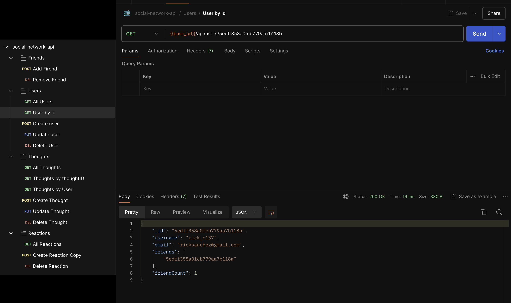
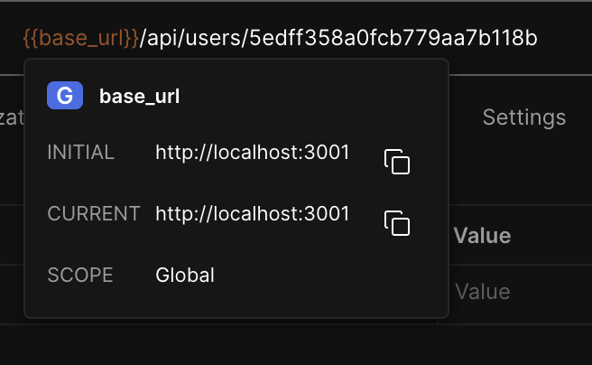

# Social Network API without SQL

## Description

This Social Network API is designed to handle large amounts of unstructured data, providing a robust backend for a social networking application. The API uses a NoSQL database (MongoDB) and is built with Node.js, Express.js, and Mongoose. It supports CRUM operations, which means it is able to create, read, update, and delete:
- Users 🤖
- Thoughts 💭
- Reactions ❕

[🎦 Click here to watch a walkthrough video of the CRUM operations in this project!](https://drive.google.com/file/d/1C9F4xe1BLvBwt4h0jpd12f1TYHjQjesQ/view?usp=sharing)

## Table of Contents

* [Installation](#installation)
* [Usage](#usage)
* [User Endpoints](#user-endpoints)
* [Thought Endpoints](#thought-endpoints)
* [Reaction Endpoints](#reaction-endpoints)
* [Credits](#credits)
* [License](#license)

## Installation

Given that this project is not deployed, you must clone this repository in order to test it in your computer.

1. Clone the repo using your command line by first navigating to the folder in which you would like the project to be stored. Then run:
 ~~~
git@github.com:marcusmr15/social-network-api.git
~~~

2. Install the required dependencies:
~~~
npm i
~~~

3. Start the server by running:
~~~
node server.js
~~~

## Usage

Once installed, you will need a tool like `Postman` or `Insomnia` to be able to interact with the API, in order to make HTTP requests to the endpoints. You can download either of them for free on the internet. 

❗Important: the `{base}` URL for all endpoints is:
~~~
http://localhost:3001/api
~~~

📹 Aside from the detailed explanation of each step about to be provided below, you can also watch a walkthrough video of the HTTP requests by [clicking here](https://drive.google.com/file/d/1C9F4xe1BLvBwt4h0jpd12f1TYHjQjesQ/view?usp=sharing) or by clicking the video's link within the [description](#description) as well. 

### User Endpoints

1. Get all Users:
~~~
GET {base}/api/users
~~~

2. Get User by ID:
~~~
GET {base}/api/users/:userId
~~~

3. Create User:
~~~
POST {base}/api/users
~~~
✏️ The request body should include username and email.
~~~
{
  "username": "john_doe",
  "email": "john@example.com"
}
~~~

4. Update User by ID:
~~~
PUT {base}/api/users/:userId
~~~
✏️ Updates a user's details by their ID. The request body can include username and/or email.

5. Delete User by ID:
~~~
DELETE {base}/api/users/:userId
~~~

6. Add Friend:
~~~
POST {base}/api/users/:userId/friends/:friendId
~~~
✏️ Adds a friend to a user's friend list. The request body should include friendId.
~~~
{
  "friendId": "5edff358a0fcb779aa7b118a"
}
~~~

7. Remove Friend:
~~~
DELETE {base}/api/users/:userId/friends/:friendId
~~~

### Thought Endpoints

1. Get all Thoughts:
~~~
GET {base}/api/thoughts
~~~

2. Get Thought by ID:
~~~
GET {base}/api/thoughts/:thoughtId
~~~

3. Get Thoughts by User:
~~~
GET {base}/api/thoughts/user/:userId
~~~

4. Create Thought:
~~~
POST {base}/api/thoughts
~~~
✏️ Creates a new thought. The request body should include text and userId.
~~~
{
  "text": "This is a new thought",
  "userId": "5edff358a0fcb779aa7b118b"
}
~~~

5. Update Thought by ID:
~~~
PUT {base}/api/thoughts/:thoughtId
~~~
✏️ Updates a thought by its ID. The request body can include text.

6. Delete Thought by ID:
~~~
DELETE {base}/api/thoughts/:thoughtId
~~~

### Reaction Endpoints

1. Get All Reactions:
~~~
GET {base}/api/thoughts/reactions/all
~~~

2. Create Reaction:
~~~
POST {base}/api/thoughts/:thoughtId/reactions
~~~
✏️ Adds a reaction to a thought. The request body should include reactionBody and username.
~~~
{
  "reactionBody": "This is a reaction",
  "username": "john_doe"
}
~~~

3. Delete Reaction:
~~~
DELETE {base}/api/thoughts/:thoughtId/reactions/:reactionId
~~~

## Credits

This project was created with the help of:
* The `ChatGPT` AI developed by __Open AI__.
* The `Xpert Learning Assistant` AI developed by __edX__.
* The [Thomas-NoSQL-Social-Network-API](https://github.com/ThomasCalle/Thomas-NoSQL-Social-Network-API) repository by [Thomas Calle](https://github.com/ThomasCalle).

## License

This project was created by [Marcos Munoz](https://github.com/marcusmr15). This repository does not have a specific license.
